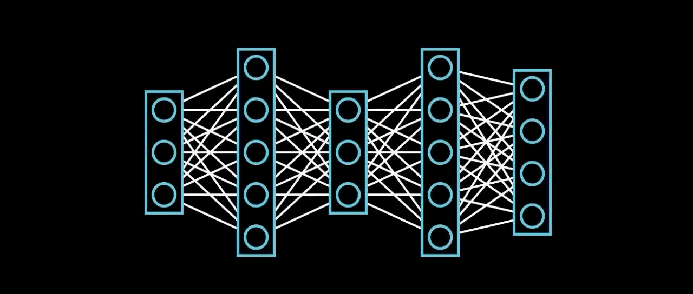

<h1 align = "center" >Hey 👋 , I'm Bingumalla Likith </h1>

**`Student | Developer | Researcher`**

I'm an enthusiastic ML/DL Engineer who loves solving real-world problems through hands-on projects. I enjoy learning new things and crafting projects from start to finish. I'm passionate about bringing ideas to life and making a difference in the field that i'm passionate about

---
### 🧰 Languages and Tools

 

#

### 📈 Stats

